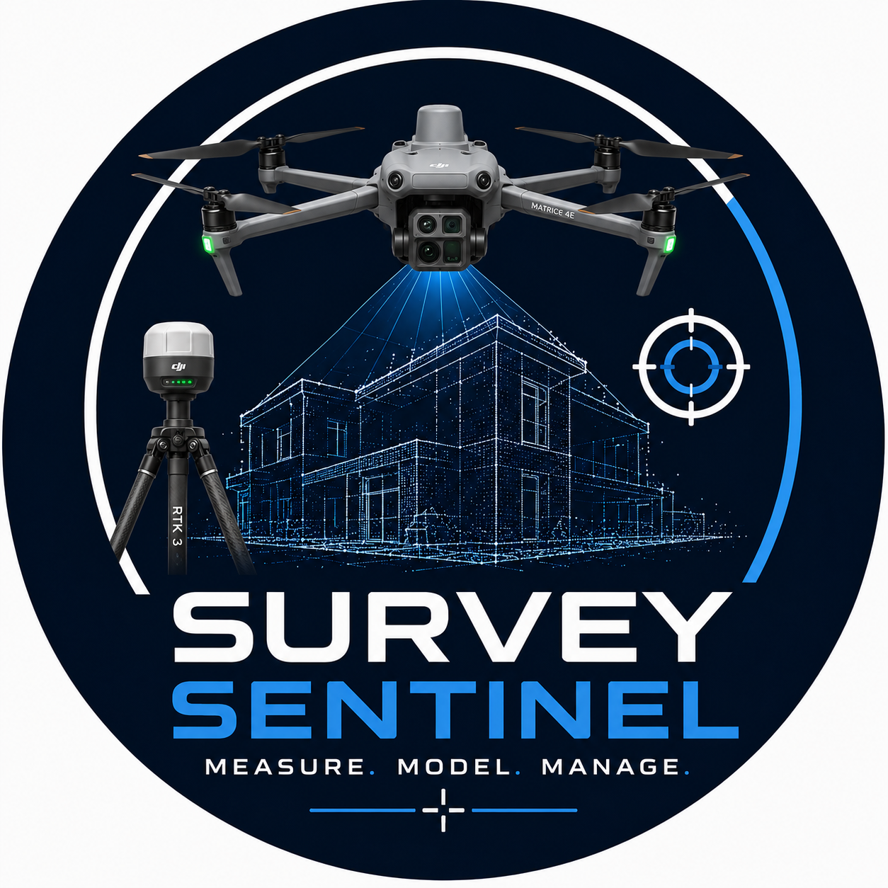

<p align="center">
   
</p>

<h1 align="center">Survey Sentinel</h1>

<div align="center">

# AI-Powered Survey Intelligence for DJI Enterprise Drones

### Transforming aerial imagery into intelligent survey data.

[]()
[]()
[]()
[]()

---

**Professional Survey Software • Artificial Intelligence • Photogrammetry • Digital Twins**

</div>

---

# Overview

SurveySentinel is a next-generation survey intelligence platform designed specifically for DJI Enterprise aircraft.

Rather than replacing existing photogrammetry software, SurveySentinel enhances professional aerial survey workflows by helping operators capture more complete, consistent and reliable datasets.

Our goal is to produce more complete, more accurate and more reliable survey datasets while reducing pilot workload and repeat site visits.

SurveySentinel combines intelligent software with DJI Enterprise platforms to help survey professionals capture higher-quality aerial datasets with greater confidence and efficiency.

---

## Explore SurveySentinel

- 📖 **Documentation** – Product guides and reference material
- 🧪 **Examples** – Sample datasets and demonstration workflows
- ⚖️ **Legal** – Licensing, governance and intellectual property

# Why SurveySentinel

Professional drone surveys are increasingly relied upon for engineering, construction, inspection and asset management.

However, conventional waypoint missions cannot always account for complex structures, occlusions or changing site conditions.

SurveySentinel is being developed to assist operators in capturing complete, high-quality survey datasets with greater confidence and fewer return visits.

# Key Features

## Intelligent Mission Analysis

- Live image quality assessment
- Coverage heatmaps
- Overlap analysis
- Missing geometry detection
- Flight quality scoring
- Automatic recapture recommendations

---

## AI-Assisted Surveying

SurveySentinel applies advanced artificial intelligence techniques to support professional aerial surveying and improve survey quality throughout the capture workflow.

---

## DJI Enterprise Integration

Designed around the DJI Enterprise ecosystem.

Current development focuses on:

- DJI Matrice 4 Enterprise
- DJI Matrice 4 Thermal
- DJI RTK 3
- DJI Manifold 3
- DJI Mobile SDK V5
- DJI Payload SDK

Future aircraft support is planned.

---

## Photogrammetry Enhancement

SurveySentinel is designed to improve downstream processing in software such as:

- WebODM
- ODM
- RealityCapture
- Agisoft Metashape
- Pix4D
- Bentley ContextCapture

---

## Survey Applications

SurveySentinel is intended for:

- Building Surveys
- Topographical Surveys
- Construction Monitoring
- Progress Recording
- Infrastructure Inspection
- Roof Inspection
- Utilities
- Heritage Recording
- Digital Twin Capture
- Asset Management

---

# Platform Overview

```text
DJI Enterprise Aircraft
        ↓
SurveySentinel
        ↓
Survey Quality Intelligence
        ↓
Improved Capture and Export
```

---

# Repository Structure

The SurveySentinel project is organised into multiple repositories.

| Repository | Purpose |
|------------|---------|
| **.github** | Organisation profile, community health files and shared templates |
| **SurveySentinel-Documentation** | Product documentation |
| **SurveySentinel-Examples** | Example projects and datasets |
| **SurveySentinel-Legal** | Commercial legal framework and licensing documentation |

Additional repositories will be introduced as development progresses.

---

# Current Focus

- DJI Enterprise integration
- Mobile application development
- Survey workflow optimisation
- Documentation
- Testing

---

# Design Principles

SurveySentinel is being developed around several core principles:

- Reliability
- Accuracy
- Professional workflows
- Modular architecture
- Security by design
- Offline capability
- Performance
- Extensibility
- Enterprise readiness

---

# Documentation

Public product documentation is maintained within the **SurveySentinel-Documentation** repository.

Licensing, governance and legal information is maintained within **SurveySentinel-Legal**.

Additional documentation will be published as SurveySentinel development progresses.

---

# Roadmap

Current focus areas include:

- DJI Enterprise integration
- AI-assisted image analysis
- Intelligent mission optimisation
- Photogrammetry enhancement
- Professional survey workflows
- Commercial licensing

Future releases will expand support for additional aircraft, sensors and enterprise integrations.

---

# Contributing

SurveySentinel is currently under active private development.

Public contribution guidelines and issue tracking will be introduced when the project reaches its first public development milestone.

---

# Licensing

SurveySentinel is a commercial software platform.

Open-source components are used where appropriate and are acknowledged within the project's legal documentation.

---

# Contact

For project enquiries, please use GitHub Discussions once available.

Commercial licensing information will be published prior to the first public release.

---

<div align="center">

## SurveySentinel

### Intelligent aerial surveying for the next generation of digital infrastructure.

**Copyright © 2026 SurveySentinel. All Rights Reserved.**

</div>
